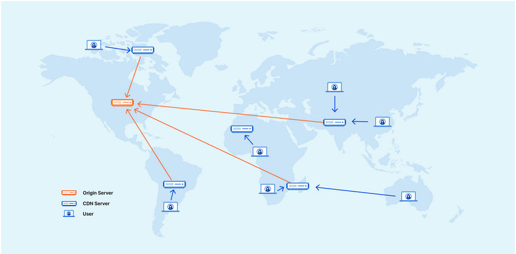

> Only 10–20% of the end user response time is spent downloading the HTML docu- ment. The other 80–90% is spent downloading all the components in the page.

## Prologue

HyperText Transfer Protocol [HTTP] is a client/server protocol, using which browsers and servers communicate with each other. HTTP sits on top of Transmission Control Protocol [TCP].

- Browsers send a HTTP request for an URL to the server. The server hosting that URL returns a HTTP response to the browser.

HTTP is made up of requests and responses. A request consists of a status code, header and body.

### Types of HTTP requests

- GET : Retrieve data from a server. It consists of an URL followed by headers
- POST : Create or update a resource in a server using the sent information.
- DELETE : Remove a resource from the server.
- OPTIONS : Return the communication option for a particular resource.
- HEAD : Retrieve only the headers of the resource from a server.
- TRACE : Establish a tunnel to the server.
- PUT : Update a resource or create it if it doesn't exist.

### Questions

**What kind of a protocol is HyperText Transfer Protocol [HTTP]?**
**What is HTTP made up of?**
**How do browsers and servers communicate with each other?**
**How does a HTTP request and response work?**
**What are the types of requests in HTTP?**
**What should a HTTP response contain?**
**What is the syntax of a GET request?**
**What is underneath HTTP?**

## Rule 1 : Make fewer HTTP requests

One way to improve response time is to reduce the number of components in a webpage. This reduces the number of HTTP requests the page produces.

### Dealing with images

Use `data:` URL scheme to include images in a page without creating additional HTTP requests.

You can also try using `background` style in CSS.

### Stylesheet

External stylesheets are great. However, they generate an additional HTTP request.

Inline CSS and `<style>` is better for performance. However, it's inefficient if your webpage contains a lot of styles.

Adapt accordingly.

### Dealing with multiple files

When we break our code into multiple small files, each file results in an additional HTTP request. This slows down the server response time.

To keep the files modular, but generate a combined target file from these modules for final usage.

### Questions

**What is a simple way to improve response time?**
**How can one include images in a page without additional HTTP requests?**
**What is a pro and a con of using `background` style in an external stylesheet and adding your image there?**
**Why would performance decrease when you modularize your web page code?**
**What is a solution to keeping files modular and not decrease performance?**

## Rule 2 : Use a Content Delivery Network

[Also refer -> [What is a content delivery network (CDN)? | Cloudflare](https://www.cloudflare.com/en-gb/learning/cdn/what-is-a-cdn/) & [What Is a CDN (Content Delivery Network)? | Akamai](https://www.akamai.com/glossary/what-is-a-cdn#accordion-b823d1c79d-item-51cc1c7d29)]



A Content Delivery Network [CDN] is a network of web servers distributed across multiple location to deliver content more efficiently.

They rely on caching, temporarily storing copies of your files in data centres. It allows you to access content from a local server.

A properly configured CDN protects websites from attacks like Distributed Denial of Service [DDoS].

One can get CDNs for various services from [CDN.js](https://cdnjs.com/).

### Benefits of using a CDN

- By distributing content closer to the visitors' area using a local CDN server, websites load faster than not doing this.
- Backups, caching and more storage.
- CDN can handle spikes in traffic as well as DDoS attacks due to it using load-balancing techniques.

### Drawbacks of using a CDN

- Response time can be affected by other sites' traffic.
- No direct control of server.
- If CDN provider's performance degrades, so does yours.

### Questions

**What is a Content Delivery Network [CDN]?**
**What is caching?**
**From which attack does a CDN protect its users from?**
**What are some benefits of using a CDN?**
**What are some drawbacks of using a CDN?**

## Rule 3 : Add an Expires Header

[Also refer -> [Expires | MDN Web Docs](https://developer.mozilla.org/en-US/docs/Web/HTTP/Headers/Expires), [Setting HTTP Caching Headers - Expires | Oracle Docs](https://docs.oracle.com/cd/E13183_01/en/alui/devdoc/docs6x/aluidevguide/tsk_pagelets_settingcaching_httpexpires.html), [Expires Header | Chemicloud](https://chemicloud.com/glossary/term/expires-header/)]

`Expires` is a HTTP response header that specifies when the content expires. So, when a content 'expires', the server comes back to check if the content has changed.

- If not changed, it continues using the cached version.
- If changed, the browser fetches the new version and you should now set a new `Expires` header.

It ensures that browsers won't try to re-fetch assets [that haven't changed] and slow down loading time.

> A **response header** is a header used in a HTTP response. It's used to give a more detailed context of the response.

```http
Expires: <three-letter-day-name>, <day> <month> <year> <hour>:<minute>:<second> GMT

Expires : Sun, 12 Jan 2030 20:00:00 GMT
```

For example, if I set an `Expires` header for images in my blog and I update my blog frequently, when the content expires, the browser will update my old images to newer ones and I've to set a new `Expires` data again.

### `Cache-control` and `max-age`

[Also refer -> [What is cache-control? | Cloudflare](https://www.cloudflare.com/en-gb/learning/cdn/glossary/what-is-cache-control/)]

It is a HTTP request AND response header that specifies caching policies to browsers and other such clients [that cache your web content] - such as who caches the response, for how long, under what conditions will the content be cached, etc.

`max-age` states how long the content can be cached [in seconds]. Note that it's the time elapsed since the response was generated on the original server.

For example, this header lets the content expires after a week.

```http
Cache-control: max-age=604800
```

### Empty cache vs primed cache

[Also refer -> [What is the difference between a primed cache and empty cache? | StackOverFlow](https://stackoverflow.com/questions/7630724/what-is-the-difference-between-a-primed-cache-and-empty-cache)]

Empty cache - Browser makes the first request to the page

Primed cache - Browser already has the page cached.

### Best solution

The best solution is to use an `Expires` header with `ExpiresDefault`.

`ExpiresDefault` is a directive used in Apache. It sets a default expiration time for all resources [no need to define them individually]. It also ensures that primed cache usage is increased as well.

```apache
<IfModule mod_expires.c>
    ExpiresActive On
    ExpiresDefault "access plus 1 year"
</IfModule>
```

Also, to ensure that users get the latest version of a component, change its file name in all the HTML pages.

### Questions

**What is a response header?**
**When is `Expires` header used?**
**What happens if a content expires?**
**Why is `Expires` used?**
**What is an alternative to `Expires`?**
**What is `Cache-control`?**
**What is `max-age`?**
**What is an empty cache scenario?**
**What is a primed cache scenario?**
**What is `ExpiresDefault`?**
**How to ensure that your users get the latest version of a component?**

## Rule 4 : Gzip Components

[Also refer -> [gzip compression | MDN Web Docs](https://developer.mozilla.org/en-US/docs/Glossary/gzip_compression) & [Gzip | Imperva](https://www.imperva.com/learn/performance/gzip/)]

When we reduce the size of the HTTP response, we reduce response times as well as transfer times. This can be done by compressing the response using gzip or deflate.

**gzip** is a file format using the gzip algorithm to compress HTTP content [responses] before it's delivered to a client.

Though a downside of it is increased CPU usage of server, it's highly recommended to use gzip.

### Questions

**What happens when we reduce the size of a HTTP response?**
**How can we reduce the size of HTTP content?**
**What is gzip?**
**What is a downside of using gzip?**
