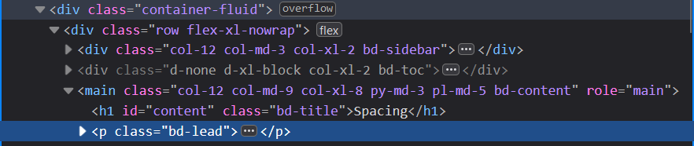

[Photo by Coekieshots on Unsplash](https://unsplash.com/@coekieshots)

> Official website for [Bootstrap](https://getbootstrap.com)
> W3Schools for [Bootstrap 5](https://www.w3schools.com/bootstrap5/bootstrap_get_started.php)

Bootstrap is the front-end toolkit one would usually learn after knowing the ins-and-outs of CSS. It is mainly used for making webpages responsive [so that they don't appear shitty in mobile].

## Including it in your webpage

First, ensure that your HTML pages starts like this :

```html
<!DOCTYPE html>
<html lang="en">
    <!--etc-->
</html>
```

Then add this following line above the `<title>` part of your HTML file :

``<meta name="viewport" content="width=device-width, initial-scale=1">``

It makes it easier for you to do responsive web design in mobile.

After doing that, add the following stylesheet in the `<head>` tag:

``<link href="https://cdn.jsdelivr.net/npm/bootstrap@5.3.3/dist/css/bootstrap.min.css" rel="stylesheet" integrity="sha384-QWTKZyjpPEjISv5WaRU9OFeRpok6YctnYmDr5pNlyT2bRjXh0JMhjY6hW+ALEwIH" crossorigin="anonymous">``

Finally, add the following `<script>` just before closing `<body>` tag :

``<script src="https://cdn.jsdelivr.net/npm/bootstrap@5.3.3/dist/js/bootstrap.bundle.min.js" integrity="sha384-YvpcrYf0tY3lHB60NNkmXc5s9fDVZLESaAA55NDzOxhy9GkcIdslK1eN7N6jIeHz" crossorigin="anonymous"></script>``

## Components

### Container

There are 2 container classes :

- `.container` : Fixed width container. Its `max-width` will change according to the screen size.
- `.container-fluid` : Full-width container

#### Spacing utility

Container also have padding in left and right. To give them extra padding and margins, we use something like this :

```html
<div class="container pt-5"></div>
```

That extra class is called a spacing utility.

Their format is ``{property}{sides}-{size}``

**`m` is for margin :**

| Class | Meaning |
| :------ |:--- |
| `m` | `margin` |
| `mt` | `margin-top` |
| `mb` | `margin-bottom` |
| `ml` | `margin-left` |
| `mr` | `margin-right` |
| `mx` | `margin-left` & `margin-right` |
| `my` | `margin-top` & `margin-bottom` |

**`p` is for padding :**

| Class | Meaning |
| :------ |:--- |
| `p` | `padding` |
| `pt` | `padding-top` |
| `pb` | `padding-bottom` |
| `pl` | `padding-left` |
| `pr` | `padding-right` |
| `px` | `padding-left` & `padding-right` |
| `py` | `padding-top` & `padding-bottom` |

Then there's size. It includes a SASS [SCSS stuff] variable called `$spacer` that acts as a base unit for this scaling stuff. Its default value is `1 rem`.

| Class | Meaning |
| :------ |:--- |
| `0` | Set at 0 |
| `1` | `$spacer * .25` |
| `2` | `$spacer * .5` |
| `3` | `$spacer` |
| `4` | `$spacer * 1.5` |
| `5` | `$spacer * 3` |
| `auto` | `auto` |

> `$spacer` can be customised using ``$spacer: {value};`` in SCSS.

### Background and text

For making your background dark with appropriately-coloured text, you use `bg-dark` with `text-white`.

For making background any other colour, on the other hand, you use `bg-primary` and then define the colour in CSS.

```html
<div class="container bg-dark text-white"></div>
<div class="container-fluid bg-primary"></div>
```

This is very useful for dark mode and light mode switching.

### Grid

```html
<div class="row">
    <div class="col">1</div>
    <div class="col">2</div>
    <div class="col">3</div>
</div>
```

### Text formatting

#### Display and small

Bootstrap features another form of heading : `.display`. It is larger than usual font-sizes and has lighter weight. Very useful for making your webpage *minimalistic*.

```html
<h1 class="display-1">Heyy</h1>
```

Then there's `<small>` as well as the `.small` class to create a smaller text right next to a heading :

```html
<h1 class="display-1">Me<small>Also Me</small></h2>

<h2 class="display-2">Yes<h3 class="small">Oui</h3></h2>
```

#### Highlighting text

`<mark>` and also `.mark` will highlight the text with a yellow background colour and some padding.

```html
<h1>On your<p class="mark">marks</p></h1>
<h2 class="display-2 mark">Get set...</h2>
<mark class="mark">GO!</p>
```

#### Abbreviating text

`<abbr>` makes sure that the text is styled with a dotted underline and displays text when the cursor hovers over it.

```html
<p>The <abbr title="General Data Protection Regulation">GDPR</abbr> is an European legislation on digital privacy and other fields.</p>
```

#### Blockquote

`<blockquote>` and `.blockquote` are used to quote blocks of text. Use `.blockquote-footer` to cite the source of the quote :

```html
<blockquote class="blockquote">
    <p>"We are the dead," echoed Julia.</p>
    <footer class="blockquote-footer">1984</footer>
</blockquote>
```

#### Lists

`<dl>` indicates a description list. In it, you use `<dt>` to style a sub-heading in the list and `<dd>` to indicate an item in the list :

```html
<dl>
    <dt>Pigeons</dt>
    <dd>- Rock dove</dd>
    <dd>- Mourning dove</dd>
    <dt>Crows</dt>
    <dd>- House crow</dd>
    <dd>- Jungle crow</dd>
</dl>
```

Now you might understand why so many webpages, when viewed from Inspect element, look like this :


