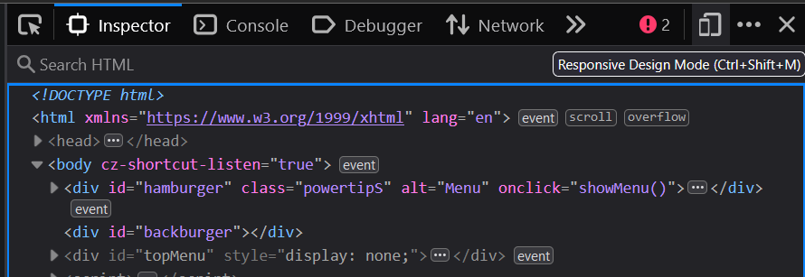
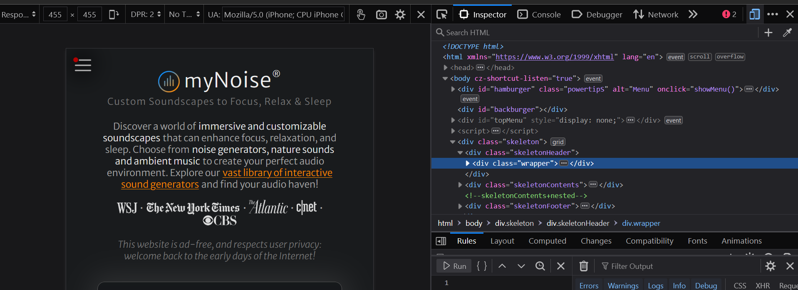

[Photo by Alejandro Escamilla on Unsplash](https://unsplash.com/@alejandroescamilla)

> Check out Kevin Powell's [video](https://youtu.be/x4u1yp3Msao?si=sBqXYf_twRiWgpO2) on responsive web design

Making websites responsive is important. Since most people nowadays are on their phones, it's crucial that you make your websites appear nicely on that small screen.

## Inspect element

First, you might want to learn how to check if your website is responsive. Taking [this website](https://mynoise.net/) as an example, you click this part in the Inspect element :





This shows you how your website would look in a mobile phone, tablet, etc.

## Images

Images are notorious for overflowing on smaller screens and making websites look shitty. Try using the following css to make it size according to the max-width of the screen.

```css
img
{
    display: block;
    max-width: 100%;
}
```

## Avoid fixed size layouts

When the screen size gets smaller, the content gets narrower in width but taller in height. This reason is why when we set a specific height to our content, it overflows when the screen size gets smaller.

So you'd instead set a `min-height` so that if the screen gets smaller, the content simply grows in height and doesn't overflow.

```css
.content
{
    min-height: 500px;
}
```

Setting `width` or `height` on icons, logos, etc. is completely fine, however.

## Don't declare stuff you don't need

Simple as that!

Don't do this stuff like this :

```css
body
{
    width: 100vw;
    height: 100vh;
}
```

## Viewport units aren't your saviour

*What are you saying? Then what do I rely on??*

What I'm saying is, viewport units aren't always going to bestow responsiveness to your page on their own. Use them sparingly and instead go for your good ol' `px`.

## Browser is your best friend

Work with the browser, not against it.

Browsers are made for this very reason - they can help to make the page responsive, they can do the heavy-lifting against many, many situations that can happen [which you're too tired to figure out].

One example would be to let the browser figure out how to handle a bunch of flex-box items arranged in a row instead of you doing all the work for it.

## If not, use media queries

If you have to resize some specific queries instead of all at once, you'd use `@media` queries.
