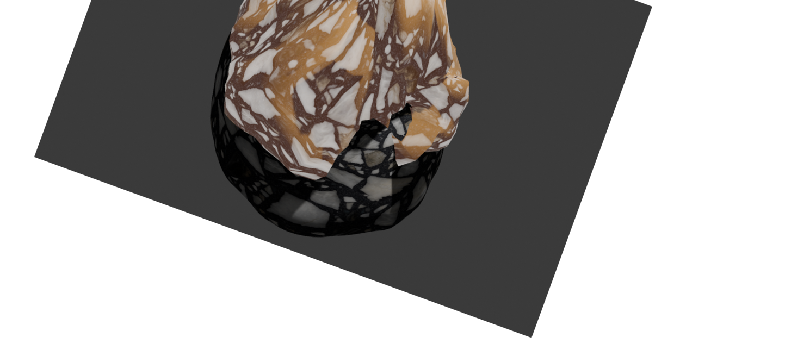

Refer -> [CSS Transforms | MDN Web Docs](https://developer.mozilla.org/en-US/docs/Web/CSS/CSS_transforms/Using_CSS_transforms)

CSS transforms change the shape and position of content without disrupting the normal flow of a page. They're applied using CSS properties to HTML elements.

## Properties

``transform-origin`` specifies the position of the origin. It is usually at the center of the element.

``transform`` specifies the transforms to apply to the element.

### Rotating

Here's a page showcasing a rock I made in Blender :


I wish to rotate it 20 degrees from its top right corner. So I add the following styles to it :

```css
#image
{
    rotate: 20deg;
    transform-origin: top right;
}
```



### Skewing

Skewing is to pick a point and push / pull it in different directions.

Here's its syntax : ``transform: skew(angle for horizontal axis, angle for vertical axis);``

Normally, an image would be in ``skew(0deg, 0deg)``. Let's say I add a Y-axis modifier :

```css
#image { transform: skew(0deg, 10deg); }
```


It rotated vertically. Now if I do the same for X-axis...

```css
#image { transform: skew(10deg, 0deg); }
```


It now rotated horizontally, resembling a parallelogram.

### Translate

Translate is the changing the position of an element.

Here's its syntax : ``translate: x-axis y-axis z-axis``

If I need to bring my image to the bottom, I'd use `translate` like this :

```css
#image { translate: 0px 140px; }
```


[Hehe, tried making it look like those articles]

### Scaling

Scaling up and scaling down. These mean increasing and decreasing the element's size.

Here's its syntax: ``scale: width height``

If I want my image to be twice the width and 0.5 times its original height, I'll go by this style :

```css
#image { scale: 2 0.5; }
```


Now that would be a decent banner image dimension.

### Matrix

One can combine animation with CSS transforms for some damn cool effects.

```css
#image
{
    /* rotate */
    rotate: 10deg;
    transform-origin: bottom right;
    /* translate */
    translate: 1px 1px;
    /* skew */
    transform: skew(10deg, 40deg);
    /* scale */
    scale: 0.1 0.1;
}
```

But we could simplify our workflow using a shorthand : `matrix()`.

Here's its syntax : ``transform: matrix(scaleX(), skewY(), skewX(), scaleY(), translateX(), translateY());``

```css
#image { transform: matrix(0.1, 1, 1, 0.1, 10, 40); }
```
