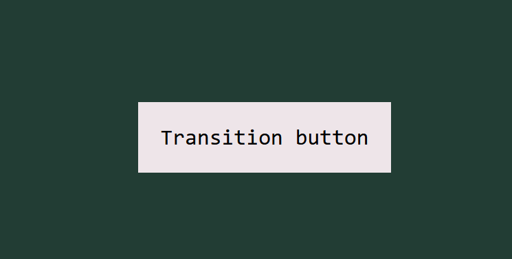

Refer -> [Using CSS transitions | MDN Web Docs](https://developer.mozilla.org/en-US/docs/Web/CSS/CSS_transitions/Using_CSS_transitions)

CSS transitions provide a way to control the animation speed of elements when they change in some way.

## Implicit transitions

If I change the colour of a button from black to blue when hovered over, such kind of animations are called implicit transitions. They transition between the initial state and the final state.

## `transition`

Transitions are controlled by `transition` property.

Here's its syntax : ``transition: <property> <duration> <timing-function> <delay>;``

- `<property>` : Name of the CSS property to which transitions are applied.
- `<duration>` : For how long?
- `<timing-function>` : Specifies the speed curve of the transition.
- `<delay>` : Waiting time until the transition begins.

Say, we've a button with the following properties :

```css
.btn
{
    background-color: #EEE5E9;
    color: #000000;
    /* other styles */
}
```



Now, we need to reverse the colours of the button.

We could normally use `:hover` selector. However, directly setting it means its animation is kinda choppy...not smooth.

```css
.btn:hover
{
    background-color: #000000;
    color: #EEE5E9;
}
```

We use the `transition` for two properties : `background-color` and `color`. Both will take 1s in duration. We also use `transition-delay` to let the mouse hover for 2 seconds before the effect.

```css
.btn
{
    transition: background-color 1s, color 1s;
    transition-delay: 2s;
}
```

> If the duration part is not specified, the transition will have no effect, because the default value is 0.

### `transition-timing-function`

There are 6 varieties of this property :

- `ease` : Starts effect with slow start, then speeds up, finally slows down.
- `linear` : Same speed from start to end.
- `ease-in` : Slow start only.
- `ease-out` : Slow end only.
- `ease-in-out` : Slow start and end.
- `cubic-bezier()` : Custom.

Now let's try applying these to our buttons.

### Using with `transform`

You can also combine `transform` with `transition` to create some cool-looking animations.

Say, I want the button to spin 360 degrees while changing its colour. I'd use `transition` along with `transform` in `:focus`. The effect would take place when you click the button.

```css
.btn
{
    transition: background-color 3s, color 3s, rotate 2s;
    transition-timing-function: ease-in;
}
.btn:focus
{
   background-color: #000000;
   color: #EEE5E9;
   rotate: 360deg;
}
```

### `transition` shorthand

Like `transform`'s `matrix()`, `transition` has a shorthand too.

```css
transition: background-color 3s, color 3s, rotate 2s ease-in 2s;
```
