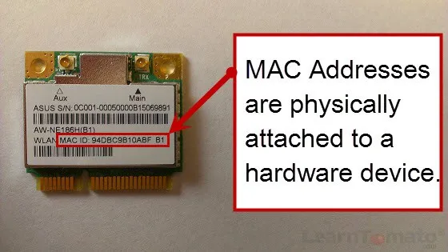
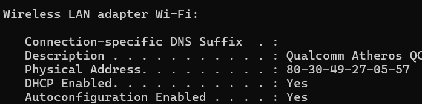

## Media Access Control [MAC] address

It is a 12-digit hexadecimal number which is assigned to each device to uniquely identify them in a network. It is related to hardware.

It's required when locating a device or performing diagnostics on a network device.

You can find your MAC address by entering ``ipconfig/all`` in the Command Prompt and looking for the Physical Address field.

## Internet Protocol [IP] address

Refer -> [What is an IP Address – Definition and Explanation | Kaspersky](https://www.kaspersky.com/resource-center/definitions/what-is-an-ip-address)

It is a string of numbers used to uniquely identify a device in the internet or local network. It allows info. to be sent between devices on a network.

IP addresses are allocated by Internet Assigned Numbers Authority [IANA]. It is assigned to your device by your ISP.

At home, you use the network provided by ISP. At work, you use your company network. IP address will change depending on the net you're using.

Turning your modem or router on and off can change your IP address.

## Port numbers

Refer -> [What Are Ports? | Akamai](https://www.akamai.com/glossary/what-are-ports)

Port numbers are 16-bit unsigned integer appended to the IP address, separated by colon. It's used to direct internet traffic arriving at a server.

Eg : In the IP address `17.253.207.54: 443`, `443` is the port which is separated by colon.

Ports are used to identify a connection endpoint and d

### Port numbers and services

| Port number | Service | Usage |
| :------ |:--- | :--- |
| 21 | File Transfer Protocol [FTP] | Transferring files b/w client & server |
| 22 | Secure Shell [SSH] | Secure access to a device over an insecure network |
| 23 | Telnet | Communicating with a server or remote device using a command line |
| 25 | Simple Mail Transfer Protocol [SMTP] | Sending emails b/w mail servers |
| 445 | Microsoft Directory Services [DS] | Managing info. about network resources and users |
| 80 | HyperText Transfer Protocol [HTTP] | Unencrypted communication across the internet |
| 143 | Internet Message Access Protocol [IMAP] | Retrieving email from a server |
| 53 | Domain Name System [DNS] | Converts domain names to their respective IP addresses |

## Trojan / Trojan horse

Refer -> [Trojan horse - Virus or malware? | Malwarebytes](https://www.malwarebytes.com/trojan) & [Trojan Horse Virus | Fortinet](https://www.fortinet.com/resources/cyberglossary/trojan-horse-virus)

A malware appearing like a legitimate program. It uses social engineering to trick users into installing it and launching the infected program in their systems.

It is delivered via emails, social-engineering, or through shady websites.

Eg : ILOVEYOU [2000], Cryptolocker

Since Trojan is a delivery strategy to deliver a threat, it can either be a tool for other malwares or a standalone malware by itself.

A computer infected by Trojan becomes a zombie computer. Hackers can control it to share the malware across many devices to create a botnet.

### Types

- **Backdoors** : Creates remote access to system; used after a system hacking for ease of access.
- **Spyware** : Watches you enter sensitive info. to steal them.
- **Downloader** : Downloads ransomwares or keyloggers
- **Zombifying trojans** : Takes control of computer to let someone else use its resources; first step of performing a DDoS attack.
