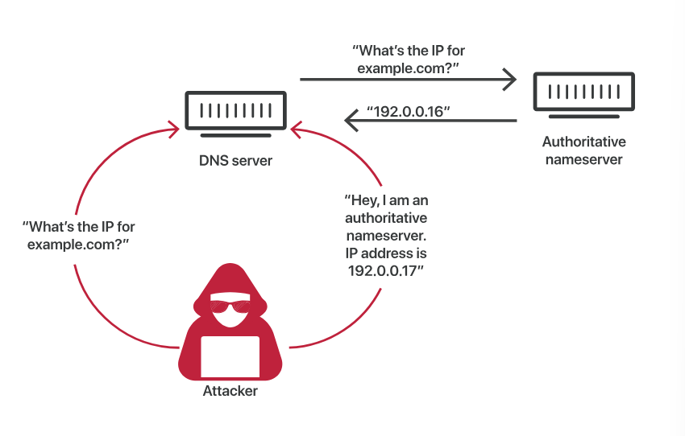

A DNS cache is a temporary storage where domains names and their IP addresses are stored in a device. Having this lets the browser quickly retrieving it when you search for a domain.

One can retrieve it in Windows using ``ipconfig/displaydns`` command.

DNS Cache Poisoning is when you enter false info. into a DNS cache, making DNS queries return an incorrect response and directing users to the wrong website.

This false info. remains in cache until the TTL [time to live] expires or it is corrected manually.

