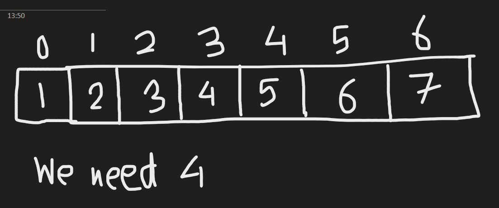
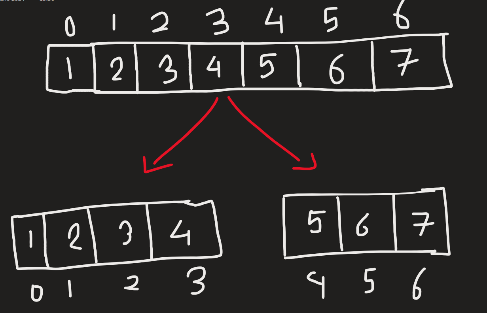
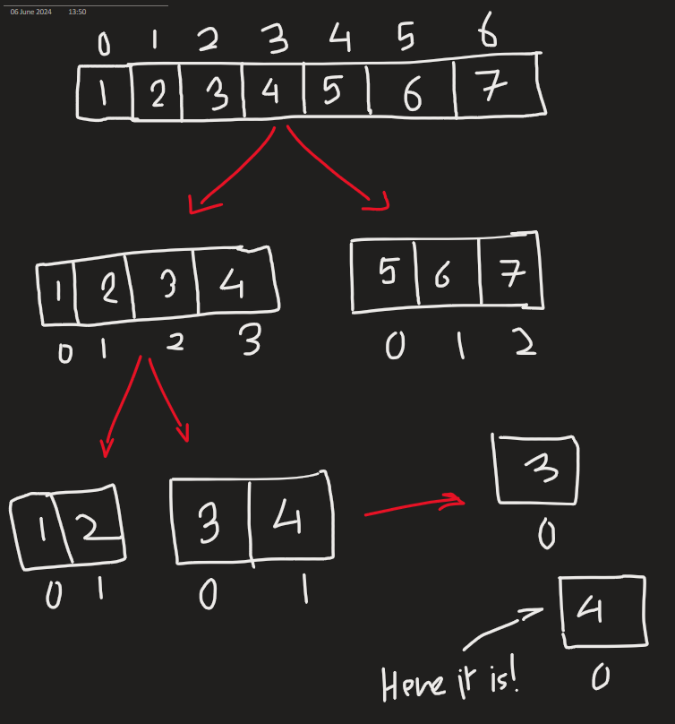

[Photo by Anthony Intraversato on Unsplash](https://unsplash.com/@anthonyintraversato)

Binary search is a **searching algorithm**. It uses the [divide-and-conquer](2024-12-01-divide-and-conquer.md) strategy to look up elements in an array.

> Searching algorithms are algorithms that parse through [go through] a list to look for an element using various methods.

## What does it do?

Let's say we have an array here and we wish to find the number 4 :



> Binary search works properly after you sort the array.

So, we go through this formula :

```algo
Low = first index
High = last index
Mid = (Low + High) / 2
```

So,

Low = 0
High = 6
Mid = (0 + 6) / 2 => 3

So we divide the array at index 3



We keep on applying the formula and eliminate half of the array until we get a sub-array with only one element in it :



### What if my element...doesn't exist in the array

Okay, now that's something. What if I do it with an non-existing element?

What happens is, the algorithm proceeds like it would for a normal binary search. Until only a single element is left.

Then what it does is to flip the low and high. This means low turns to the right-hand-side while high turns to left-hand-side. It will keep doing this flipping back and forth...until the system crashes, of course.

## Show me in program

Say, we've an array and wish to get the number 5:

```js
const arr = [1, 2, 3, 4, 5, 6, 7];
```

We first obtain the values for low and high :

```js
let firstIndex = 0;
let lastIndex = arr.length - 1;
```

Then we'd have a function for binary search :

```js
function binarySearch(array, low, high, elementNeeded)
{
    while (low <= high)
    //so that the low and high do not flip
    {
        let mid = Math.floor((low + high) / 2);
        
        if (elementNeeded===array[mid])
        {
            return mid;
        }
        else if (elementNeeded<array[mid])
        {
            high = mid - 1;
        }
        else
        {
            low = mid + 1;
        }
    }
    return "Element not found";
}
```

Finally, we have the user input the element needed and the output that changes depending on whether we've the element or not:

```js
const prompt = require(`prompt-sync`)({sigint:true});
let key = Number(prompt("Which element is needed? "));
let keyIndex = binarySearch(arr, firstIndex, lastIndex, key);
if (keyIndex==="Element not found")
{
    console.log("Could not find the element.");
}
else
{
    console.log(`${key} is present at index ${keyIndex}`);
}
/*
Which element is needed? 5
5 is present at index 4

Which element is needed? 10
Could not find the element.
*/
```

> Use ``const prompt = require(`prompt-sync`)({sigint:true});`` to get prompt in VSCode.
