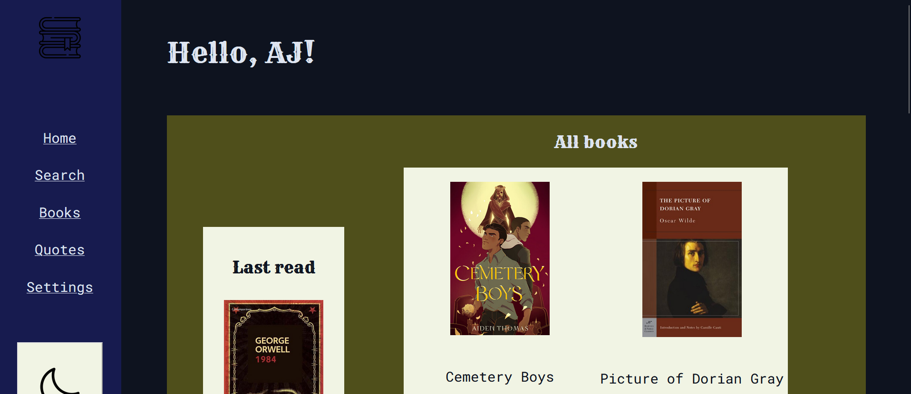

In politics or history, you must've heard of the term - **divide and rule**. Now, if you aren't familiar with it, it means gaining power by using divisive measures.

By causing division amongst the populace of a nation, a foreign ruler can conquer that nation with ease.

Similarly, **divide-and-conquer** is a programming technique. Instead of populace, we deal with dividing problems into smaller problems to conquer [i.e. get solution] easily.

By this logic, we undergo 3 steps :

- Break down large problem into smaller problems
- Get solution to each small problem
- Combine solutions of smaller problems to get the solution of the large problem.

## Example

An example would be...let's say we're building a web-page.

*I know, I know...this is one of my own web-pages. But what better example could I provide, if not my own?*

To build a web-page, we normally plan the structure [how it should look and all] and work on the HTML and CSS part. Then we go to JS and get the interactive part of it ready.

And, to make this daunting task easier, I usually keep a handy checklist like this :

- [] Dark mode shift btn
- [] Pop-up asking name from user
- [] Get name of user on screen
- etc.

So when I work on the project, I'd simply have to work one problem at a time and not worry about tackling a large problem at once. It's like eating an elephant, one at a time.
