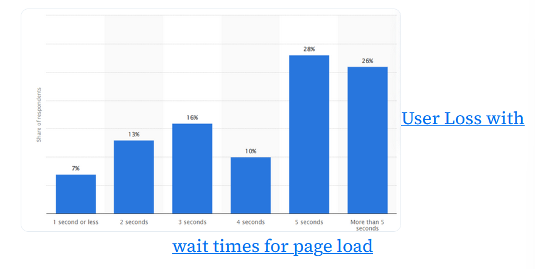

Refer -> [How fast should a Website Load in 2024? | BrowserStack](https://www.browserstack.com/guide/how-fast-should-a-website-load), [The ultimate guide to web performance | Beyond Fireship](https://youtu.be/0fONene3OIA?si=43C0dBNMoBY2dHSz), [Web Vitals | web.dev](https://web.dev/articles/vitals)

**Load time** is the time taken by a webpage to fully render on an user's browser. It depend on elements like file size, status of server and host, how well the website's coded, etc.

A **bounce rate** is a web traffic metric that measures the % of visitors leaving after viewing only 1 page in a website.

**Latency** is the time taken from making a HTTP request to receiving its response. It's also the time taken for a data packet to travel from source to destination.

Load times are directly proportional to bounce rates. Higher load times indicate higher bounce rates. A high bounce rate causes the website to rank less in the search engine and not get much traffic.

> Statistics indicate the 40% of visitors leave a website if its loading time is more than 3 seconds.

Parts of checking web performance would include :

- Are the animations smooth?
- Does this site load quickly?
- Does it offer proper feedback if something's taking time to load?

## Metrics involving website load time

**Time to First Byte [TTFB]** is the time between a browser sending a HTTP request to a server and obtaining its first response.

**Page load time** determines how long a page takes to load completely.

**Server response time** determines how long it takes to receive a complete response from a server.

**First Contentful Paint [FCP]** is the time taken for the first content of the page to appear on screen, while **Largest Contentful Paint [LCP]** is the time taken for the largest content to appear on screen.

> A page may have an LCP of 2.5 sec or less.

To get better LCP...

- Use formats like `webp` and `avif`, use the bare minimum no. of fonts needed to render the page.
- Serve assets from a CDN like Firebase or Vercel.
- Don't let JS run before the assets are rendered, use server-side frameworks like Next.js instead of single-page applications like React.
- Use `rel="preload"` in your stylesheet, script files, etc.

**First Input Delay [FID]** tracks time between the user interacting with the page [aka submitting a request] and the browser reacting.

> To optimise it, reduce your JS execution time to less than 300 msec.

Time taken by a site to get to an usable stage after loading is called **time to interactive** [TTI].

**Cumulative Layout Shift [CLS]** measures visual stability, seeing if elements aren't jumping around in unexpected way around the page. To avoid issues in this, use `srcset` or `aspect-ratio` in HTML-CSS.

## Reasons for slow loading times

- **Poor server performance** : The server takes longer to react, like a car engine taking a while to start. It can also happen if the server is shared between many hosts.
- **Unsuitable server location** : Long-distance server calls need more time to connect and thus, it might take a while.
- **Heavy traffic** : A server will load slowly due to exceeding its limit of requests. Upgrade has to be done as a result.
- **Excessive flash content** : Flash content is heavy and slows down website performance. Replace them with HTML counterparts.
- **Code density** : Huge web elements slow down the loading speed.
- **Increased HTTP requests** : This is due to page having lots of JS, CSS and picture assets. Every time a user visits the website, the browser sends too many requests and slows down the page.
- **Too many ads** : Too many ads result in additional HTTP requests and slowing down of page.
- **Lack of CDN** : CDN assigns a website local servers to serve content from them easily.
- **Inadequate caching techniques** : If a browser doesn't use cache, it'll have to retrieve all the data the next time it reloads, making it slower than if cache is used.

## How to optimise loading times

- Reduce image file sizes
- Use a CDN
- Minify HTML, CSS and JS
- Use browser caching
- Reduce your redirects
- Use techniques like lazy loading
