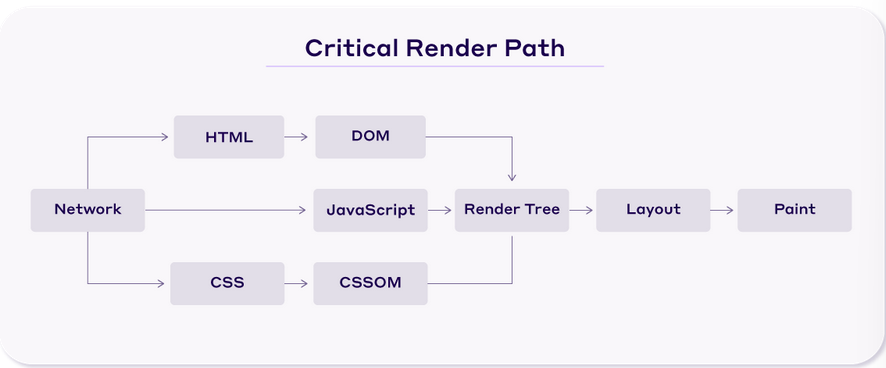
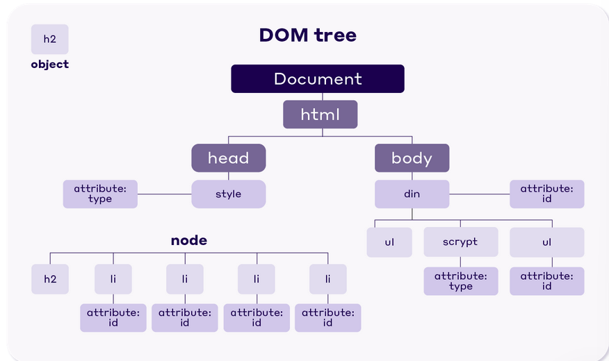
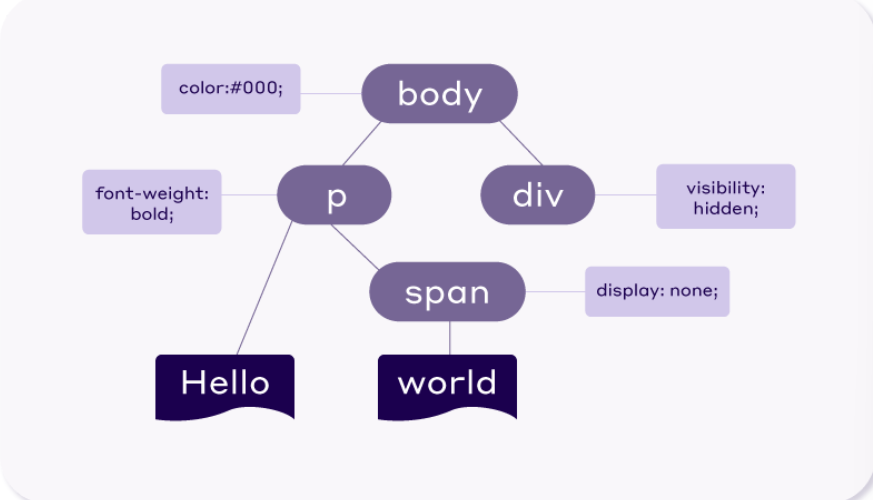

[References]

- [Critical rendering path | MDN Web Docs](https://developer.mozilla.org/en-US/docs/Web/Performance/Critical_rendering_path)
- [Critical Rendering Path: What It Is and How to Optimize It | NitroPack](https://nitropack.io/blog/post/critical-rendering-path-optimization)

Critical Rendering Path [CRP] are the steps taken by a browser to convert your code into a visible webpage. If it is optimised [if time taken is reduced], render performances improves as well.

## Parts of CRP

- **Document Object Model [DOM]** : Created as HTML is parsed and can be modified by JS
- **CSS Object Model [CSSOM]** : Created when HTML includes a stylesheet or makes requests for styles [like Bulma, Bootstrap, etc.]
- **Render tree** : Combination of DOM, CSSOM and JS
- **Layout** : Determines size and location of everything on the page

### DOM

DOM is the browser's representation of your HTML document. It is gradually constructed.

Each node is a HTML element whose properties describe its attributes, content, etc.

Avoid excessive DOM size to optimise CRP.

### CSSOM

CSSOM includes info. to style the DOM. It's processed all at once.

Browser blocks the rendering process until all the CSS is parsed. This is due to some styles being overwritten later in the file.

### Render tree

Render tree is a combo of DOM and CSSOM. It's used to calculate node dimensions and positions.

Only visible content is contained in it. This is why the head section, elements with `display: none` style are excluded.

### Layout

Layout defines the dimension, position, relationships of each element on the page.

Greater the number of DOM nodes, longer the laying out process is, and worser the performance would be.

## Process

- Browser downloads and parses HTML to create the DOM.
- It then downloads and processes CSS to create the CSSOM.
- It combines DOM and CSSOM with needed JS to create a Render Tree.
- It calculates the dimensions and position of every element on the page to create the page layout.
- The browser renders the website on screen.

These factors contribute to CRP length :

- Document size
- Number of DOM nodes
- Applied styles
- Device

## Optimisation

- Remove unused files
- Use techniques like minification, caching, compressing
- Give hints to browser using `link rel="prefetch"` and `link rel="preconnect"`
- Load JS asynchronously so that it can be executed alongside HTML document's parsing.
- Combine multiple CSS stylesheets into a single stylesheet.
- Use `defer` attribute in script file if it need not be loaded immediately.
- Use Critical CSS to identify minimal set of CSS rules needed to render the visible part of the webpage.
