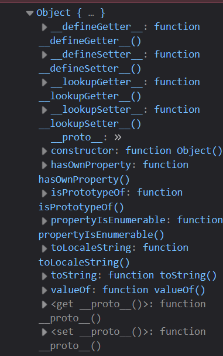

First, take note of these 3 statements :

- All objects have a prototype.
- The prototype is another object that the original object inherits from.
- The original object has access to all of its prototype's methods and properties

Nothing seems to make sense for now. Let me guide you.

## What is a prototype?

[View [this article at Digital Ocean](https://www.digitalocean.com/community/tutorials/understanding-prototypes-and-inheritance-in-javascript) for more info.]

Every object in JS has an internal property called `[[Prototype]]`. It creates a way for two or more objects to be linked together.

We can't access it directly; instead we use the `getPrototypeOf()` method.

```js
let x = {};
Object.getPrototypeOf(x);
```

When we put this in the browser console :



Another way to do so is through ``x.__proto__``.

`__proto__` is depreciated and shouldn't be used at all!
{: #myid .alert .alert-info .p-3 .mx-2 mb-3}

## Prototypal inheritance

There are 2 reasons why we define properties and functions on the prototype :

One, to have common properties and functions to save memory.

Two, to have prototypal inheritance.

It just means our objects inherit from the `className.prototype` object which allows them to access functions and properties defined in it. The prototype object is itself inheriting from `Object.prototype`, thus forming a chain of inheritances.

`hasOwnProperty()` tells you if an object [or prototype] has a property :

```js
pOne.hasOwnProperty('loc'); //true
pOne.hasOwnProperty('valueOf'); //false

Object.prototype.hasOwnProperty('valueOf'); //true
Object.prototype.hasOwnProperty('hasOwnProperty'); //true
```
