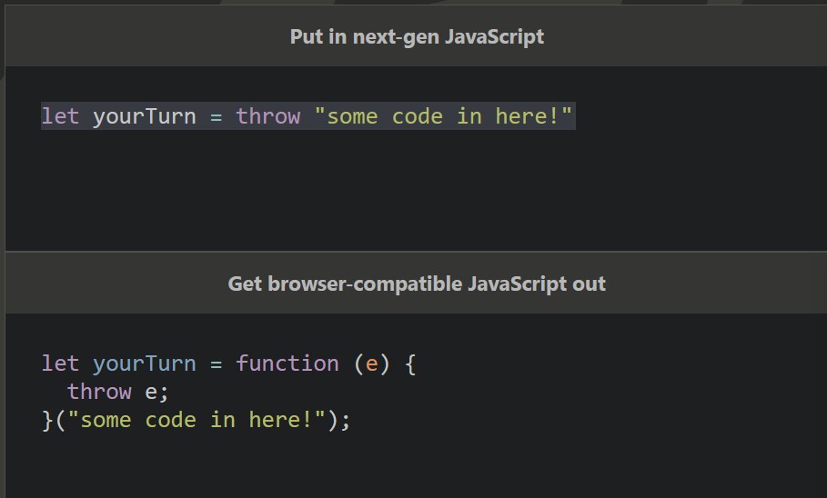

ECMAScript [European Computer Manufacturer's Association Script] is a standard for scripting languages like JavaScript.

One of its major releases was in 2015. It is known as ES6, ECMAScript 6, or ESM.

## What has it introduced so far?

ES6 introduced the following features :

- Arrow shorthand `=>`
- Classes
- Template string defined using `
- Spread parameters `function funct(param, ...others)`
- `let` and `const`
- `for-in` and `for-of` loops
- Support for Unicode characters
- Modules
- `map` and `set`
- `Symbol` data type
- Libraries such as `Math`, `Number`, etc.
- `Promise` in asynch JS

## Modules

We can enable importing-exporting stuff by adding this to our HTML file :

```html
<script src="script.js" type="module"></script>
```

This enables modules to be added to the JS file.

To export a function, variable, anything written in another file, we use `export` :

```js
export let greeting = "Hey Anon!";

export function renderBook()
{
    const mainContainer = document.querySelector('.books-place');
    //creating elements
    const bookContainer = document.createElement('div');
    const description = document.createElement('div');
    let pagesReadText = document.createElement('p');
    let pagesInTotalText = document.createElement('p');
    const btnContainer = document.createElement('div');
    //...
}
```

Or we can export them together :

```js

function renderBook()
{
    const mainContainer = document.querySelector('.books-place');
    //creating elements
    const bookContainer = document.createElement('div');
    const description = document.createElement('div');
    let pagesReadText = document.createElement('p');
    let pagesInTotalText = document.createElement('p');
    const btnContainer = document.createElement('div');
    //...
}
let greeting = "Hey Anon!";
export { greeting, renderBook() };
```

Now if we've to import them into another file, we use `import` :

```js
import { greeting, renderBook() } from "./render.js";
```

### Default exports

Sometimes, if we don't wish to give a name to our export and instead take care of it in the other file, we use `default` keyword :

```js
function renderBook()
{
    const mainContainer = document.querySelector('.books-place');
    //creating elements
    const bookContainer = document.createElement('div');
    const description = document.createElement('div');
    let pagesReadText = document.createElement('p');
    let pagesInTotalText = document.createElement('p');
    const btnContainer = document.createElement('div');
    //...
}
export default renderBook();
```

Now if we import it...

```js
import creatingBook() from "./render.js";
```

A file can only default export one thing.
{: #myid .alert .alert-info .p-3 .mx-2 mb-3}

## Babel

Check out Babel [here](https://babeljs.io/)

Babel is a tool used to transpile your latest edition JS code to older browsers so that stuff doesn't break.



**Transpiling** : Taking source code to convert it to a different version of the same language.
{: #myid .alert .alert-info .p-3 .mx-2 mb-3}
