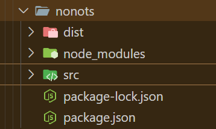

npm is a package manager that may seem similar to Node Package Manager, but it is.

*"Contrary to popular belief, npm is not in fact an acronym for "Node Package Manager"; It is a recursive bacronymic abbreviation for "npm is not an acronym" (if the project was named "ninaa", then it would be an acronym)."* - npm website
{: #myid .alert .alert-info .p-3 .mx-2 mb-3}

npm is previously based on a bash utility named pkgmakeinst [package make instant] or pm. Hence, npm is best called node pm or new pm.

[Bacronym - Acronym formed from an already existing word]
{: #myid .alert .alert-info .p-3 .mx-2 mb-3}

### Node.js

[Check out [Node.js](https://nodejs.org/en) website to install it]

npm works best with Node.js, which is a JS runtime environment [just like JVM is a runtime environment for Java].

## Let's see how `npm` works

Say, I want to get the README.md of my profile.

You can make readme for your Github profile by simply creating a repository whose name is your username.
Eg : `max-github`'s README.md will be in the repo, `max-github`
{: #myid .alert .alert-info .p-3 .mx-2 mb-3}


### `hello`

We can use a `npm` package called `hello`, which can be found [here](https://www.npmjs.com/package/hello).

```bash
npm i hello
npx hello {github-username}
```

In my case, it'd show something like this :

```bash
# 👋 Hello, I'm Aiglelevant

# tagline and location

My Github username is @aigle-levant (https://github.com/aigle-levant) where I have 26 repos (https://github.com/aigle-levant?tab=repositories) and I'm following 14 accounts (https://github.com/aigle-levant?tab=following).
I've been on Github for just over 4 years (since November 2020).
You can find me on my website (https://aigle-levant.github.io/notes/blog/).   

I am also available for hire!
```

### `moment`

Moment is another package that deals with dates in JS. You can find it [here](https://momentjs.com/docs/#/use-it/).

First, we install an important file called `package.json`. It's required if you're using any npm package :

```bash
npm init -y
```

Then we install moment using the following command.

```bash
npm i moment
```

You'll see a folder called node_modules in the directory, it is where moment will be stored.

There will be another file named package-lock.json. That file tells you the details about the libraries installed. DO NOT TOUCH IT.

#### Using moment

In a JS file, import moment and use it as you wish :

```js
import moment from "moment";
let moment = require("moment");
let something = moment().format();
```

Now, `moment().format()` accepts many arguments, some of which can be found [here](https://momentjs.com/).

I'd like it to print today's date :

```js
let today = new Date();
let something = moment(today).format("LL");
```

If you try to run this, you might run into a `ReferenceError`. It's because `require()` is unknown to the browser. To fix this, you could use a module bundler called webpack.

##### Webpacks

To install web-packs, use the following command :

```bash
npm install webpack webpack-cli --save-dev
```

Then create 2 folders : `src/` and `dist/` in your directory. Place the JS file in `src/` and HTML file in `dist/`.



After that, go back to the main directory and create a webpack-config.js file :

```js
const path = require('path');

module.exports =
{
    entry: './src/{yourJSFile.js}",
    output:
    {
        filename: 'main.js',
        path: path.resolve(__dirname, 'dist'),
    },
    mode: 'development',
};
```

After that, add this line to your package.json :

```json
"scripts":
{
    "build": "webpack"
},
```

Then go to the command line and type this command :

```bash
npm run build
```

A main.js file would've been created inside dist/ folder. Finally, in your HTML file, change the `src` in `<script>` to main.js and you're done!

```js
//December 16, 2024
```

If we wish to make changes, we simply edit our JS file [not main.js], run `npm run build` command and that's it.

## `package.json`

It is a JSON file containing information about our project - its name, dependencies, version number, etc.

```json
{
  "name": "my-awesome-package",
  "version": "1.0.0",
  "author": "Your Name <email@example.com> (https://example.com)"
}
```

To create a `package.json` file, navigate to the root directory of where you'd like the package to be in the command line and run :

```bash
npm init
```

Then answer the questions that come up next and you're done!

If you don't want to spend time answering questions and get the default values, do this :

```bash
npm init --yes
```

You'll get the following JSON file :

```json

{
  "name": "my_package",
  "description": "make your package easier to find on the npm website",
  "version": "1.0.0",
  "scripts": {
    "test": "echo \"Error: no test specified\" && exit 1"
  },
  "repository": {
    "type": "git",
    "url": "https://github.com/monatheoctocat/my_package.git"
  },
  "keywords": [],
  "author": "",
  "license": "ISC",
  "bugs": {
    "url": "https://github.com/monatheoctocat/my_package/issues"
  },
  "homepage": "https://github.com/monatheoctocat/my_package"
}
```

To add custom questions, create a file `.npm-init.js` and add questions with the `prompt()` function :

```js
module.exports = prompt("Purpose of usage?", "Personal");
```

To add custom fields, do the following in the same file :

```js
module.exports =
{
    fieldName: "Stuff",
    fieldNameTwo: "Again, stuff"
}
```
