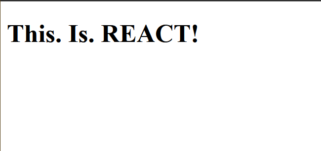

[Photo by Kelly Sikkema on Unsplash](https://unsplash.com/@kellysikkema)

Essentially, React takes your JS code and adds code to your HTML document.

## Set up

To set up React, you need to do 3 things.

- First, you need to include React libraries and Babel in your document
- Next, you need to create a root variable.
- Lastly, you've to render some markup to this root.

### React library

To do anything with React, you'll need its library. And if it's in web, you need its DOM library.

But why Babel? It's for a reason I'll tell you later.

```html
<head>
    <!--stuff goes here-->
    <script src="https://unpkg.com/react@18/umd/react.development.js"></script> <!--react library-->
    <script src="https://unpkg.com/react-dom@18/umd/react-dom.development.js"></script> <!--react dom library-->
    <script src="https://unpkg.com/@babel/standalone/babel.min.js"></script> <!--babel-->
</head>
```

At the `<script>` part of your HTML, where you'd normally add your JS files, try this :

```html
<script type="text/babel" src="app.jsx"></script>
```

Since we're importing Babel, we pass our file through Babel then to our document. Babel is our middleman here.

React uses the file extension `.jsx`.
{: #myid .alert .alert-info .p-3 .mx-2 mb-3}

#### Now we're back in business!

In the same document, create a `<div>` element where React will insert content :

```html
<body>
    <div id="root"></div>
    <script type="text/babel" src="app.jsx"></script>
</body>
```

### Root

In the `app.jsx` file, first I obtain that root element we created before. Then I create a variable to hold this `createRoot()` function and pass `rootElement` as an argument : :

```jsx
let rootElement = document.getElementById("root");
let root = ReactDOM.createRoot(rootElement);
```

I finally call `render()` with `root`. Its argument is the stuff I want to display in my webpage :

```jsx
root.render(<h1>This. Is. REACT!</h1>);
```

Aaand...we're done!



### Questions

- What are the steps required to set up React?
- Name the modules that you include in your document to let React work :
- Why do we need to create a `<div id="root">` element?
- Which function lets you create a root variable?
- What does `render()` do?

## Why did you use Babel, though?

Coming back to your question, why use Babel?

You see, when you run the code above in the browser [be it without the library and Babel, or just without Babel], you get these errors :

```cmd
Loading module from “{your jsx file path name}” was blocked because of a disallowed MIME type (“text/jsx”).

Loading failed for the module with source “{your jsx file path name}”.
```

This happens because browsers just *don't know* how to deal with JSX. One way to let it deal with it is to transpile it into plain old JS. A tool like Babel does everything for ya.

### Questions

- Why do we need to use Babel for doing things with React?
- What happens if we don't use Babel?
- What does Babel do, exactly?
